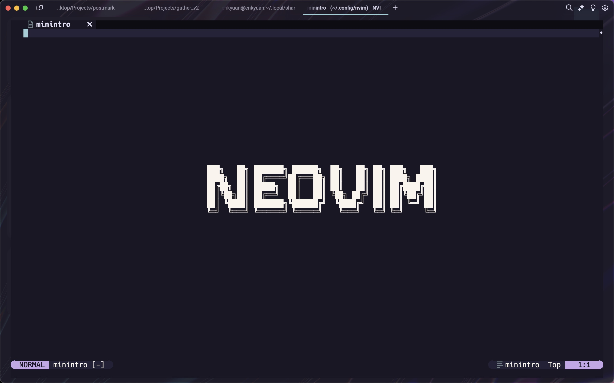
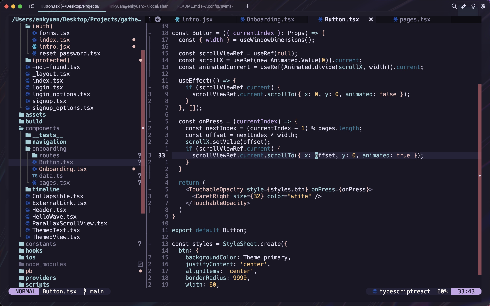

# personal nvim config

## about

### plugins

> defaults, i.e., neotree, aerial, lualine, bufferline, etc.

FTERM - floating terminal manager
 
Rose Pine - theme

...and many more

### hotkeys

> leader is spacebar

default vim keybinds with...

<kbd>leader </kbd> + <kbd>f</kbd> for fuzzy finder
 
<kbd>leader</kbd> + <kbd>vf</kbd> for neotree
 
<kbd>leader</kbd> + <kbd>vt</kbd> for floating terminal (FTERM)
 

...and many more

## screenshots

### minitro 

### editor

